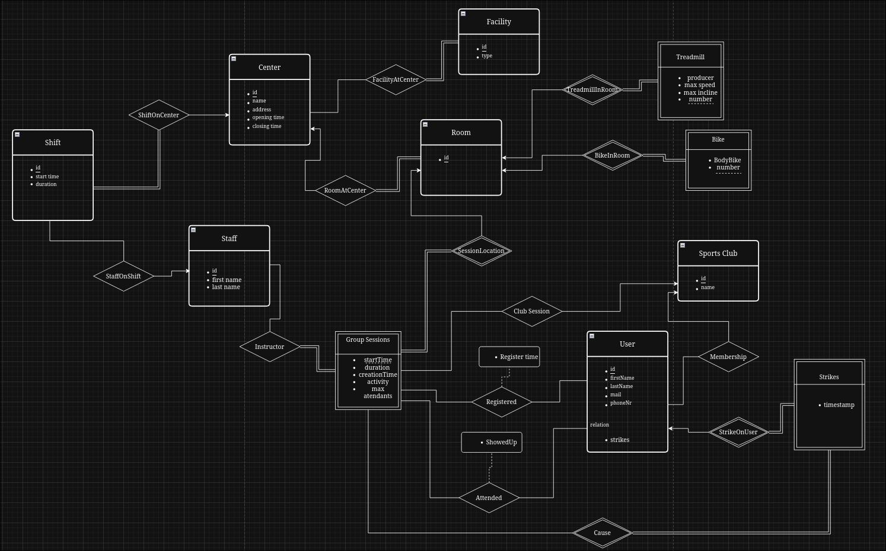

# Handin 1 database

## Diagram

## a)

We assume that facility types are defined as enums.

We made strikes weak, because a strike depends on the existence of the user that got the strike.

We assume that staff can have other roles and responsibilities than just instructors. A staff member can for example be stationed in the centers counter.

We separated the registered relation from the attended relation. This could be done as a single relation, but would open the possibility for null values. By introducing a separate relation for keeping track of attendance we increase redundancy, since the attended and registered relation contain similar information, but eliminates the possibility of null values.

Based on information found on Sit's website we concluded that it was suficient to have opening times as an attribute of Center, since it was consistent for all days of the week.

The following constraints are not displayed in the ER-diagram:

- Constraints on maximum number of attendees for each group session and waitinglists.
- Constraints tied to deadlines. This includes group sessions opening for registration, and deregistration deadline to avoid strikes.
- Multiple sessions cannot take place in the same room at the same time, and an instructor cannot be instructor in two different sessions at the same time.
- Preventing overlapping bookings and sessions for rooms. A room cannot be booked by two drifferent clubs at the same time, and a booked room cannot be used for other group sessions.
- Limitations on registration based on memberships in sport clubs for relevant group sessions.
- Limitations on registration based on strikes.

## b) Normal forms

### 1. normal form

It is trivial to see that all the tables have atomic values, and that there is no duplicate rows possible in any of the tables. Aswel as atmoicity, we have that the order of the rows don't play any role in how the data is understood.

### 2. normal form

#### Trivial tables
All the tables with a primary key that is only the id is automatically in the second normal form. This goes for 'shifts', 'users', 'staff', 'centers', 'facilities', 'rooms', 'treadmills', 'bikes', 'sport_clubs'. This is because when the key is only an id, there can't be any partial dependencies on that key.

#### Strikes, Instructor For and Facility at center
The tables 'strikes', 'facility_at_center' and 'instructor_for' are in the second normal form because all the columns in the tables is part of the primary key. Therefore they has no partial dependencies on the primary key.

#### Group sessions
Primary key: 'start_time' and 'room_id'
Columns 'max_attendants', 'activity', 'creation_time', 'club_id', 'description' and 'duration' does not depend on anything other than the entire primary key. For 'max_attendants' doesn't depend on 'room_id' because an instructor can choose how many can attend the group session. 

#### Registered and Attended
These tables are essentially the same, but 'registered_time' and 'showed_up' are different columns. Nither depends on anything but the entire primary key.

### BCNF
When a table is in BCNF, it is impossible for transitive dependency to occur, meaning it is also in thrid normal form. Therefore we omit writing about the thrid normal form.

#### All columns are part of the primary key
The tables 'strikes', 'facility_at_center' and 'instructor_for' is trivial because the primary key is the entire table. 

#### Only one column along with the primary key
Tables that only include one column and the primary key are also trivial. These tables are 'registered', 'attended', 'rooms', 'sport_clubs' and 'facilities'.

#### Users, centers, shifts, staff and group sessions
'shifts', 'centers', 'staff', 'users', 'treadmills' and 'group-sessions' is the BCNF because none of the columns depend on any other column except for the primary key, id.

#### Treadmills and bikes
The 'bikes', and 'treadmill' have a composite primary key, consisting of the 'room_id' and 'number'. All the other columns only depend on the primary key. 

## c)

We considered implementing constraints on maximum allowed attendees for spinning sessions based on the number of spin bikes available in the room. We decided not to implement these constraints due to it limiting how instructors structure sessions. It is for example possible to use other equipment in addition to spin bikes and rotate on who uses the bikes.

We have not implemented constraints to limit number of registrations when a sessions max capacity is reached. This is because we want to use the register table to implement a waiting list. We want to do this in the systems frontend.

## d)

1. How (or can) you ensure that an instructor cannot be present in two different places at the same time? Can you achieve this using your model, or does something like this have to be implemented in the software.

We have implemented this with a trigger that fires on insert to the 'shifts' and 'instructor_for' tables. The trigger check if the staff already is working during this time. If the staff already works, the insert will be aborted. 

2. The same question for a user. Can this be solved in the model or must it be done in the software?

We also have a trigger for when inserting to the 'user' table. The trigger checks if the user already is registered for another group session, and aborts the insert if the user already is registered for another group session.

3. From which use case is the exclusion (blacklisting) tested / created? It does not have to be one of the stated use cases.

When a user tries to remove their registration less than one hour before session start, a strike is awarded. Trying to register for a session while having three strikes results in an error stating one cannot attend a group session with thre active strikes. A strike is active for 30 days after issue. Whether a strike is active or not is not excplicitly stored as a column, but calculated from 'strike_time' when trying to register for a group session. This behaviour is tested in the file test_strikes.sql.

4. Are statistics something that must be stored explicitly or is it possible to just make queries to get answers? Discuss this.

For many statistics it is possible to use queries to find relevant information from the database. Therefore there is no tables that represent statistics explicitly. To have more statistics available in the database, we could change the registration from deleting rows, to instead be a boolean. That way the database would have statistics for every user that a some point was registered for the group session.

